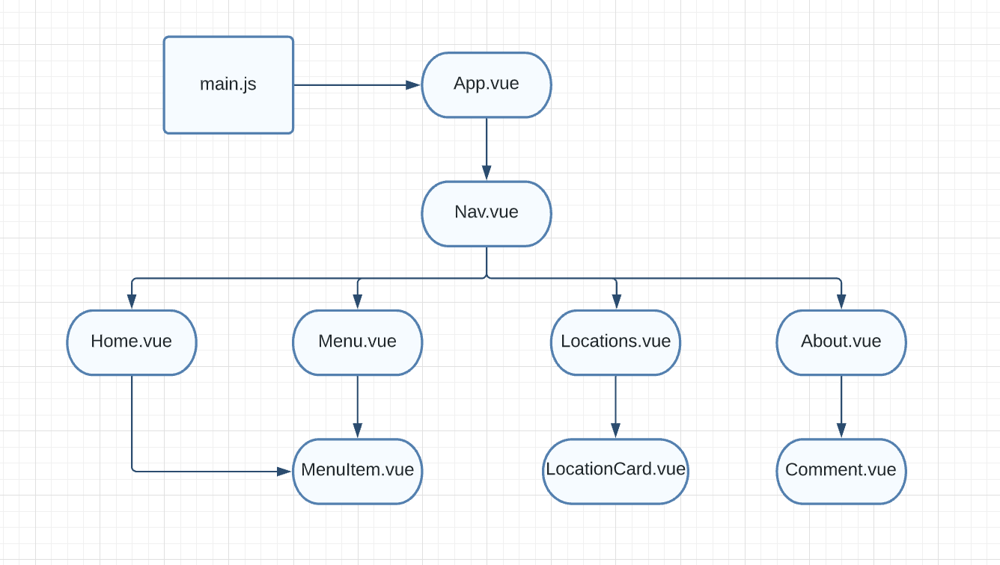
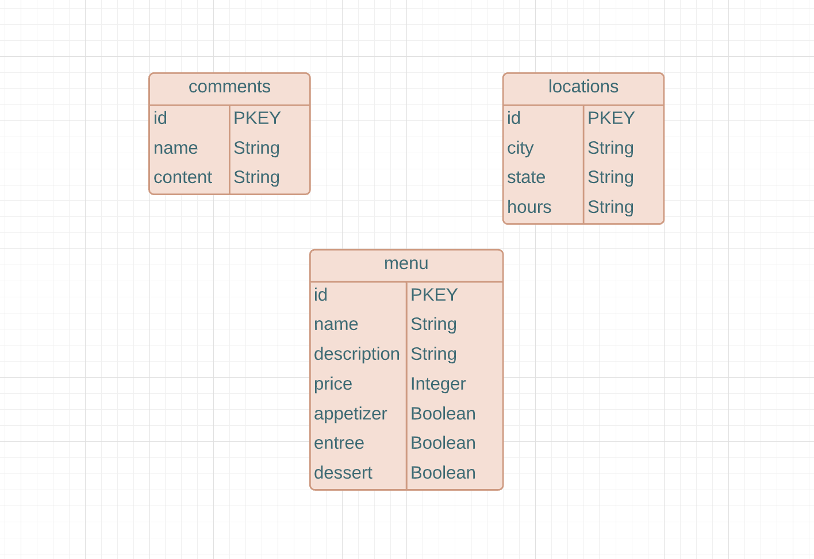

# Folha

## Date: 10/10/2021

### By: Jin Im Brancalhao

[GitHub](https://github.com/jinimbrancalhao) | [LinkedIn](https://www.linkedin.com/in/jin-im-826a6b215/) | [Instagram](https://www.instagram.com/jinnybphoto/)

---

**_Description_**

This app is a website for a fine-dining restaurant named Folha. It serves as an online reference for customers to learn about the restaurant, find all restaurant locations or search for specific locations, view the menu or specific courses, and create/read/update/delete reviews.

**_Technologies Used_**

- PostgreSQL
- Express.js
- Vue.js
- Node
- Heroku
- Sequelize

**_Getting Started_**

#### Planning:

[Trello](https://trello.com/b/IUqttuWT/folha)

[Diagrams](https://lucid.app/lucidchart/bdcfc9da-1281-4c33-a9ce-df47ce789922/edit?viewport_loc=449%2C220%2C1098%2C1188%2C0_0&invitationId=inv_d3409a7f-35cc-4063-98ea-a5bf503edfa1)

#### Deployed Link:

[Heroku]()

**_Screenshots_**

#### Home Page

#### Menu Page

#### About Page

**_Future Updates_**

- [ ] Online Reservation Feature
- [ ] Integrate UI
- [ ] Search Location by address / city

**_Credits_**

- Stack Overflow
- Image Slide: [digitalocean](https://www.digitalocean.com/community/tutorials/vuejs-create-image-slider)
- Text over Image Slide: [tutorialrepublic](https://www.tutorialrepublic.com/faq/how-to-position-text-over-an-image-using-css.php)
- Images: [Google Images](https://www.google.com/)
- Recipes: [Google Images](https://www.google.com/)
